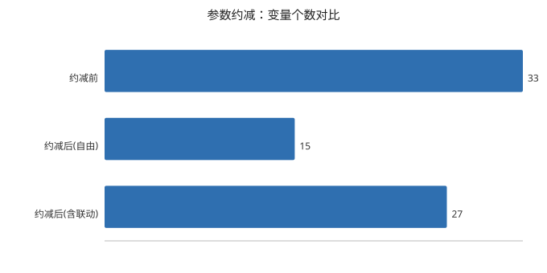
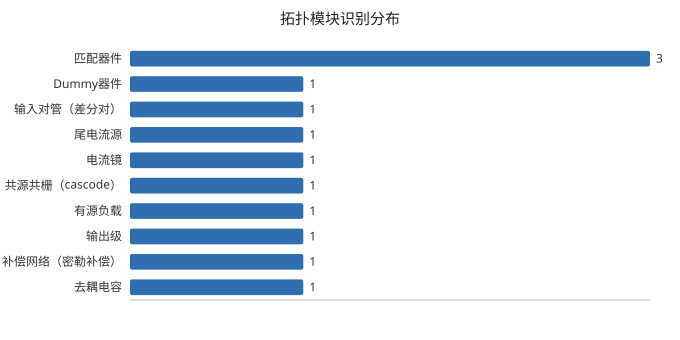

# 模拟电路 AI 智能化设计 —— 技术报告

> 赛题二 · 2026"中国电子杯"高校ICT产教融合创新大赛
> 命题单位：北京华大九天科技股份有限公司

| 项目 | 内容 |
|---|---|
| 报告生成时间 | 2026-09-22 21:46 |
| Spec 解析来源 | `rule` |
| 识别到的模块数 | 12 |
| 变量约减 | 33 → 自由变量 15 个（含联动 27 个） |
| 回归测试 | Ran 100 tests in 0.293s |


## 1. 作品概述与系统架构

本作品实现赛题二的完整链路，覆盖"自然语言 → 结构化 Spec → 拓扑识别与参数约减 →
多目标尺寸优化 → 自动化流程与交付物"五个环节。

```
自然语言 Spec ──► ①Spec解析 ──► ②拓扑识别与参数约减 ──► ③多目标尺寸优化 ──► ④自动化链路
                  agent1        agent2                    q3_optimizer         tools/
                  规则主干      多角色标注                 可行性优先DE         打包+报告
                  +LLM增强     +PDK变量模型
```

**核心设计取舍：** 规则解析是主干、LLM 是增强层（而非相反），
因此系统在没有 API Key 时也能完整跑通第①②问；
LLM 与规则的结果做交叉校验，差异作为报告证据。

**核心技术决策：**

| 决策 | 理由 |
|---|---|
| 拓扑识别采用多角色标注而非互斥划分 | 一个 PMOS 镜像同时就是有源负载，互斥划分会让"有源负载"整项消失 |
| 参数约减两遍处理（依赖型模块优先） | 多角色下同一器件属于多个模块，顺序错了会让匹配对丢掉变量合并 |
| 优化采用可行性优先而非加权惩罚 | PM/GM/I_OPA 是"全有或全无"的 30 分，宁可少赚目标分也不能让约束崩 |
| 参数文件读写保真优先 | 真实格式未知，原样回写比"解析成漂亮结构"更安全 |


## 2. 第①问：自然语言 Spec 解析

### 2.1 SystemPrompt（赛题要求附上）

```text
你是一位模拟集成电路设计专家。你的任务是把自然语言描述的电路性能规格解析为严格的结构化 JSON（Spec）。

输出必须是一个 JSON 对象，包含且仅包含以下字段：
{
  "hard_constraints": [     // 硬约束：出现"不低于/至少/不超过/大于"等硬性要求
    {"key": <指标名>, "op": "<>|<|>=|<=", "value": <数值>, "unit": <单位>}
  ],
  "optimization_targets": [ // 优化目标：出现"尽可能大/尽量小/越大越好"等
    {"key": <指标名>, "direction": "max|min", "unit": <单位>, "priority": <整数,1最高>}
  ],
  "units": { "<指标名>": "<单位>" },
  "priorities": { "<优化目标名>": <整数> }
}

合法指标名（必须使用这些规范名）：
- DCGain: 直流增益 (dB)
- UGB: 单位增益带宽 (MHz)
- PM: 相位裕度 (deg)
- GM: 增益裕度 (dB)
- I_OPA: 运放工作电流 (mA)
- Area: 芯片面积 (um^2)
- CMFB: 共模反馈 (bool, 若要求"带共模反馈"则放入 hard_constraints: {"key":"CMFB","op":">","value":0,"unit":"bool"})

规则：
1. 只输出 JSON，不要任何解释、不要 markdown 代码块。
2. 单位统一：MHz、mA、dB、deg、um^2；"所有PVT下"等限定语附加到 constraint 的 "cond" 字段。
3. 约束中的比较词映射：不低于/至少/大于等于→">="，不超过/至多→"<="，大于→">"，小于→"<"。
4. 无法解析为数值的要求不得丢弃，放入 hard_constraints 并给 value=null。
```

### 2.2 Few-shot 示例

```text
示例输入：请设计一个带有共模反馈的全差分运放，要求：DC 增益不低于95dB，单位增益带宽至少60MHz，相位裕度大于55度，所有PVT下工作电流不超过3mA，并尽量减小面积。
示例输出：
{"hard_constraints":[{"key":"CMFB","op":">","value":0,"unit":"bool"},{"key":"DCGain","op":">=","value":95,"unit":"dB"},{"key":"UGB","op":">=","value":60,"unit":"MHz"},{"key":"PM","op":">","value":55,"unit":"deg"},{"key":"I_OPA","op":"<=","value":3,"unit":"mA","cond":"所有PVT"}],
"optimization_targets":[{"key":"Area","direction":"min","unit":"um^2","priority":1}],
"units":{"DCGain":"dB","UGB":"MHz","PM":"deg","I_OPA":"mA","Area":"um^2"},
"priorities":{"Area":1}}
```

### 2.3 解析结果（四要素）

原始输入：

> 请设计一个带有共模反馈的全差分运放，要求：DC增益不低于95dB，单位增益带宽至少60MHz，相位裕度大于55度，所有PVT下工作电流不超过3mA，并尽量减小面积。

**硬约束项**

| 指标 | 比较 | 数值 | 单位 | 条件 | 来源 |
|---|---|---|---|---|---|
| CMFB | > | 0 | bool | - | 原文 |
| DCGain | >= | 95 | dB | - | 原文 |
| UGB | >= | 60 | MHz | - | 原文 |
| PM | > | 55 | deg | - | 原文 |
| I_OPA | <= | 3 | mA | 所有PVT | 原文 |
| GM | <= | -10 | dB | 所有PVT | 赛题默认补齐 |

**优化目标与优先级**

| 优先级 | 指标 | 方向 | 单位 | 来源 |
|---|---|---|---|---|
| 1 | UGB | max | MHz | 由 >= 60 派生 |
| 2 | Area | min | um^2 | 原文 |
| 3 | DCGain | max | dB | 由 >= 95 派生 |

**指标单位表**：CMFB=bool、DCGain=dB、UGB=MHz、PM=deg、I_OPA=mA、Area=um^2


**解析假设（可审计）**

- 补入赛题强制约束 GM <= -10 dB（原文未明确给出）


### 2.4 LLM × 规则 交叉校验

本次解析未走 LLM 路径（`--no-llm`），或尚无交叉校验数据。

> _(待服务器真实数据补充)_


### 2.5 推理链日志（Chain-of-Thought）

共 9 次 LLM 调用，累计思维链 17165 字。每次调用的 system/user prompt、思维链、原始响应、用量均已落盘。

| 时间 | 用途 | 模型 | 耗时(s) | 思维链(字) | 响应(字) |
|---|---|---|---|---|---|
| 20260922_210837 | spec_parse | qwen3.8-max | 14.15 | 0 | 460 |
| 20260922_211415_371 | spec_parse | qwen3.8-max | 14.6 | 840 | 474 |
| 20260922_211516_798 | spec_parse | qwen3.8-max | 85.06 | 11498 | 448 |
| 20260922_211555_437 | spec_parse | qwen3.8-max | 9.49 | 273 | 785 |
| 20260922_211633_594 | spec_parse | qwen3.8-max | 19.07 | 1311 | 460 |
| 20260922_212629_448 | spec_parse | qwen3.8-max | 13.07 | 736 | 460 |
| 20260922_212707_002 | spec_parse | qwen3.8-max | 10.64 | 363 | 805 |
| 20260922_213658_343 | spec_parse | qwen3.8-max | 18.46 | 1919 | 460 |

**最近一次思维链节选**

```text
我们需要回答用户：将自然语言规格解析为严格 JSON。用户输入与示例几乎相同。需要只输出 JSON，不要 markdown。必须包含 hard_constraints, optimization_targets, units, priorities。合法指标名：DCGain, UGB, PM, GM, I_OPA, Area, CMFB。CMFB 要求带共模反馈，放入 hard_constraints: {"key":"CMFB","op":">","value":0,"unit":"bool"}。DC增益不低于95dB -> >= 95 dB。UGB至少60MHz -> >=60 MHz。P …
```


## 3. 第②问：拓扑模块识别与参数约减

### 3.1 识别结果

输入网表：`tests/sample_netlist.sp`；器件 13 个（M=10、R=1、C=2、L=0）；作用域 1 个。

| 作用域 | 模块类型 | 器件 | 角色 | 识别依据 | 置信度 |
|---|---|---|---|---|---|
| opa | Dummy器件 | MDUM1, MDUM2 | Dummy器件 | D/S 接同一节点（或命名含 dummy），不参与信号放大，作为匹配/边界哑管，不设优化变量 | 0.85 |
| opa | 输入对管（差分对） | M1, M2 | 输入对管（差分对）+匹配器件 | 两管极性相同（NMOS），源极共连至尾节点 tail，栅极分别接 inp / inn，构成差分输入对 | 0.95 |
| opa | 尾电流源 | M0 | 尾电流源 | 漏极接差分对尾节点 tail，源极接电源轨 vdd，栅接偏置 biasp，为输入对提供恒定尾电流 | 0.9 |
| opa | 电流镜 | M7, M3, M4 | 电流镜+匹配器件 | PMOS 源极共连 vdd，栅极共连 mirp；M7 栅漏短接为参考臂，M3、M4 按比例镜像 | 0.9 |
| opa | 共源共栅（cascode） | M5, M1, M6, M2 | 共源共栅（cascode）+匹配器件 | 上管源极接在下管漏极上（M5.S=M1.D(drn1)、M6.S=M2.D(drn2)），同极性堆叠、上管非二极管连接，栅极共接固定偏置 biasn，用于提高输出阻抗/增益 | 0.85 |
| opa | 有源负载 | M3, M4 | 有源负载 | 接在差分对输出节点上、向电源轨提供负载电流的管子（镜像负载/共源共栅负载）；这是第一级的增益负载，与电流镜角色并存 | 0.85 |
| opa | 输出级 | M5, M6 | 输出级 | 漏极直接驱动输出端口 outn, outp，决定输出摆幅与驱动能力 | 0.8 |
| opa | 补偿网络（密勒补偿） | CC1, RC1 | 补偿网络（密勒补偿） | 跨接在两级之间、两端均非电源轨的电容，用于频率补偿/设置主极点，并与调零电阻串联（消右半平面零点） | 0.75 |
| opa | 去耦电容 | CDEC | 去耦电容 | 一端接电源轨的电容，用于电源去耦/滤波，不参与信号通路 | 0.8 |
| opa | 匹配器件 | M1, M2 | 匹配器件 | 同族前缀 + 同模型 + 同极性 + 尺寸参数完全相同，属版图匹配结构（同时归属：输入对管（差分对）） | 0.6 |
| opa | 匹配器件 | M3, M4, M7 | 匹配器件 | 同族前缀 + 同模型 + 同极性 + 尺寸参数完全相同，属版图匹配结构（同时归属：电流镜） | 0.6 |
| opa | 匹配器件 | M5, M6 | 匹配器件 | 同族前缀 + 同模型 + 同极性 + 尺寸参数完全相同，属版图匹配结构（同时归属：共源共栅（cascode）） | 0.6 |

### 3.2 器件 → 角色映射（多角色标注）

| 器件 | 功能角色 |
|---|---|
| MDUM1 | Dummy器件 |
| MDUM2 | Dummy器件 |
| M1 | 输入对管（差分对）、匹配器件、共源共栅（cascode） |
| M2 | 输入对管（差分对）、匹配器件、共源共栅（cascode） |
| M0 | 尾电流源 |
| M7 | 电流镜、匹配器件 |
| M3 | 电流镜、匹配器件、有源负载 |
| M4 | 电流镜、匹配器件、有源负载 |
| M5 | 共源共栅（cascode）、匹配器件、输出级 |
| M6 | 共源共栅（cascode）、匹配器件、输出级 |
| CC1 | 补偿网络（密勒补偿） |
| RC1 | 补偿网络（密勒补偿） |
| CDEC | 去耦电容 |

> 同一器件出现在多个角色中，是**多角色标注**的直接体现：例如接在差分对输出节点上的 PMOS 镜像同时是「电流镜」和「有源负载」。


### 3.3 参数约减

变量个数：**33 → 自由变量 15 个**（含联动变量共 27 个，约减率 55%）。








**联动变量（非独立，随参考变量按初始比例缩放）**

| 变量 | 约束 |
|---|---|
| M2_w | =M1_w |
| M2_l | =M1_l |
| M2_m | =M1_m |
| M3_w | =M7_w |
| M3_l | =M7_l |
| M3_m | =M7_m |
| M4_w | =M7_w |
| M4_l | =M7_l |
| M4_m | =M7_m |
| M6_w | =M5_w |
| M6_l | =M5_l |
| M6_m | =M5_m |

**完整变量表**（`variables.csv`）

| variable | value | min | max | unit | type | constraint | reason |
|---|---|---|---|---|---|---|---|
| M1_w | 2u | 0.13 | 20.0 | um | float | free | 输入对管（差分对）各管强制同尺寸，合并为单变量 |
| M1_l | 0.5u | 0.13 | 10.0 | um | float | free | 输入对管（差分对）各管强制同尺寸，合并为单变量 |
| M1_m | 1 | 1 | 20 |  | int | free | 输入对管（差分对）各管强制同尺寸，合并为单变量 |
| M2_w | 2u | 0.13 | 20.0 | um | float | =M1_w | 匹配联动，强制与首器件同尺寸（非独立变量） |
| M2_l | 0.5u | 0.13 | 10.0 | um | float | =M1_l | 匹配联动，强制与首器件同尺寸（非独立变量） |
| M2_m | 1 | 1 | 20 |  | int | =M1_m | 匹配联动，强制与首器件同尺寸（非独立变量） |
| M7_w | 4u | 0.13 | 20.0 | um | float | free | 电流镜参考臂，自由变量 |
| M7_l | 0.5u | 0.13 | 10.0 | um | float | free | 电流镜参考臂，自由变量 |
| M7_m | 1 | 1 | 20 |  | int | free | 电流镜参考臂，自由变量 |
| M3_w | 4u | 0.13 | 20.0 | um | float | =M7_w | 电流镜镜像联动，按初始比例随参考臂缩放（非独立变量） |
| M3_l | 0.5u | 0.13 | 10.0 | um | float | =M7_l | 电流镜镜像联动，按初始比例随参考臂缩放（非独立变量） |
| M3_m | 1 | 1 | 20 |  | int | =M7_m | 电流镜镜像联动，按初始比例随参考臂缩放（非独立变量） |
| M4_w | 4u | 0.13 | 20.0 | um | float | =M7_w | 电流镜镜像联动，按初始比例随参考臂缩放（非独立变量） |
| M4_l | 0.5u | 0.13 | 10.0 | um | float | =M7_l | 电流镜镜像联动，按初始比例随参考臂缩放（非独立变量） |
| M4_m | 1 | 1 | 20 |  | int | =M7_m | 电流镜镜像联动，按初始比例随参考臂缩放（非独立变量） |
| M5_w | 8u | 0.13 | 20.0 | um | float | free | 匹配器件各管强制同尺寸，合并为单变量 |
| M5_l | 0.5u | 0.13 | 10.0 | um | float | free | 匹配器件各管强制同尺寸，合并为单变量 |
| M5_m | 2 | 1 | 20 |  | int | free | 匹配器件各管强制同尺寸，合并为单变量 |
| M6_w | 8u | 0.13 | 20.0 | um | float | =M5_w | 匹配联动，强制与首器件同尺寸（非独立变量） |
| M6_l | 0.5u | 0.13 | 10.0 | um | float | =M5_l | 匹配联动，强制与首器件同尺寸（非独立变量） |
| M6_m | 2 | 1 | 20 |  | int | =M5_m | 匹配联动，强制与首器件同尺寸（非独立变量） |
| M0_w | 4u | 0.13 | 20.0 | um | float | free | 尾电流源成员，保留为独立变量 |
| M0_l | 0.5u | 0.13 | 10.0 | um | float | free | 尾电流源成员，保留为独立变量 |
| M0_m | 2 | 1 | 20 |  | int | free | 尾电流源成员，保留为独立变量 |
| CC1_value | 1p |  |  | F | float | free | 补偿网络（密勒补偿）成员，保留为独立变量 |
| RC1_value | 1k |  |  | ohm | float | free | 补偿网络（密勒补偿）成员，保留为独立变量 |
| CDEC_value | 10p |  |  | F | float | free | 去耦电容成员，保留为独立变量 |

**PDK 取值约束**

- M: W 0.13u~20u, L 0.13u~10u, m 1~20(整数)
- R: Seg 1~20(整数)
- C: L 0.13u~20u (W 沿用同区间)
- L: 以 PDK 器件为准
- 面积公式：晶体管 `f*w*L*m*1.5`、电容 `W*L`、电阻 `W*L*2`

### 3.4 约减后网表

```spice
* 全差分运放示例网表（两级 Miller 补偿 + 理想 CMFB，供本地测试）
.include process_models.sp

* ======================================================================
* 本文件由 agent2_topology 自动生成：第②问 参数约减结果（变量化网表）
* 变量总数 27 = 自由变量 15 + 联动变量 12
* PDK 取值约束：M: W 0.13u~20u, L 0.13u~10u, m 1~20(整数)；R: Seg 1~20(整数)；C: L 0.13u~20u (W 沿用同区间)
* 变量命名与第③问参数文件一致：<器件名>_<参数>（如 M7_w / M7_m / R1_seg）
* 所有变量都在下方 .param 块中声明；联动变量以表达式引用参考变量，
* 因此本网表可直接自洽仿真（变量名与 variables.csv 一一对应）。
* 联动关系（非独立变量，随参考变量按初始比例缩放）：
*   M2_w = M1_w    (匹配联动，强制与首器件同尺寸（非独立变量）)
*   M2_l = M1_l    (匹配联动，强制与首器件同尺寸（非独立变量）)
*   M2_m = M1_m    (匹配联动，强制与首器件同尺寸（非独立变量）)
*   M3_w = M7_w    (电流镜镜像联动，按初始比例随参考臂缩放（非独立变量）)
*   M3_l = M7_l    (电流镜镜像联动，按初始比例随参考臂缩放（非独立变量）)
*   M3_m = M7_m    (电流镜镜像联动，按初始比例随参考臂缩放（非独立变量）)
*   M4_w = M7_w    (电流镜镜像联动，按初始比例随参考臂缩放（非独立变量）)
*   M4_l = M7_l    (电流镜镜像联动，按初始比例随参考臂缩放（非独立变量）)
*   M4_m = M7_m    (电流镜镜像联动，按初始比例随参考臂缩放（非独立变量）)
*   M6_w = M5_w    (匹配联动，强制与首器件同尺寸（非独立变量）)
*   M6_l = M5_l    (匹配联动，强制与首器件同尺寸（非独立变量）)
*   M6_m = M5_m    (匹配联动，强制与首器件同尺寸（非独立变量）)
* 自由变量（可交给第③问优化器）：
*   M1_w = 2u  取值 0.13~20.0um    (输入对管（差分对）各管强制同尺寸，合并为单变量)
*   M1_l = 0.5u  取值 0.13~10.0um    (输入对管（差分对）各管强制同尺寸，合并为单变量)
*   M1_m = 1  取值 1~20    (输入对管（差分对）各管强制同尺寸，合并为单变量)
*   M7_w = 4u  取值 0.13~20.0um    (电流镜参考臂，自由变量)
*   M7_l = 0.5u  取值 0.13~10.0um    (电流镜参考臂，自由变量)
*   M7_m = 1  取值 1~20    (电流镜参考臂，自由变量)
*   M5_w = 8u  取值 0.13~20.0um    (匹配器件各管强制同尺寸，合并为单变量)
*   M5_l = 0.5u  取值 0.13~10.0um    (匹配器件各管强制同尺寸，合并为单变量)
*   M5_m = 2  取值 1~20    (匹配器件各管强制同尺寸，合并为单变量)
*   M0_w = 4u  取值 0.13~20.0um    (尾电流源成员，保留为独立变量)
*   M0_l = 0.5u  取值 0.13~10.0um    (尾电流源成员，保留为独立变量)
*   M0_m = 2  取值 1~20    (尾电流源成员，保留为独立变量)
*   CC1_value = 1p    (补偿网络（密勒补偿）成员，保留为独立变量)
*   RC1_value = 1k    (补偿网络（密勒补偿）成员，保留为独立变量)
*   CDEC_value = 10p    (去耦电容成员，保留为独立变量)
* ======================================================================
.param M1_w=2u
.param M1_l=0.5u
.param M1_m=1
.param M7_w=4u
.param M7_l=0.5u
.param M7_m=1
.param M5_w=8u
.param M5_l=0.5u
.param M5_m=2
.param M0_w=4u
.param M0_l=0.5u
.param M0_m=2
.param CC1_value=1p
.param RC1_value=1k
.param CDEC_value=10p
.param M2_w=M1_w
.param M2_l=M1_l
.param M2_m=M1_m
.param M3_w=M7_w
.param M3_l=M7_l
```


## 4. 第③问：基于约束的多目标尺寸优化


### 4.1 为什么"可行性优先"

赛题 6.3(2) 是**全有或全无**：PM / GM / I_OPA 三项，任一项在任意 PVT 下不满足，
该项直接扣满 10 分；而 6.3(3) 的 DCGain / UGB / Area 是按名次比例给分。
因此最优策略是先保证 100% 可行，再在可行域内优化目标。

实现上用约束支配（Deb 思想）：只要有可行解就绝不接受不可行解；
两个都不可行时比较归一化违反度。

### 4.2 预算倒推（3 小时时限）

```
可用评估次数 = 总时限 × (1 - 预留比例) ÷ 单次仿真耗时
```
预留默认 20%，留给反标与全 PVT 验证。先跑一次真实仿真测出单次耗时，再决定种群与代数。

### 4.3 工程保障

| 需求 | 实现 |
|---|---|
| VPN 掉线 | 每次迭代落盘 `checkpoint.json`，`--resume` 续跑 |
| 过程取证（评分项 6） | `optimization_log.jsonl` 逐次记录参数/指标/违反度 |
| 交付物一致 | 最优尺寸写回 `param_file`，并保留 `.orig` 备份 |

### 4.4 优化结果

> _(待服务器真实数据补充)_

> 拿到华大九天账号后，运行 `optimization.py` 会产出 `optimization_result.json`，重跑本生成器即可自动填入真实结果。


## 5. 第④问：PyAether 自动化链路

一条命令跑完全流程：

```
参数化电路图 ──► MDE 仿真 ──► 指标提取 ──► 优化迭代 ──► 尺寸反标 ──► 全PVT验证 ──► 报告
 schematic_var      ALPS/MDE     output.log    优化器        var_best      报告
```

### 5.1 接口契约（阶段 1 需用真实资产校准）

| 项 | 当前状态 | 待办 |
|---|---|---|
| CLI 参数 | 与赛题 PDF 第 13–14 页完全一致 | 无需改动 |
| `param_file` 格式 | 保真读写，未改动行逐字节一致 | 用真实样例补回归用例 |
| 仿真命令 | `--sim-cmd` 模板（`{param_file}` / `{out}`） | 填入官方脚本实际命令 |
| 指标解析 | 多 corner 取最坏值 | 用真实 `output.log` 校准 |
| 变量命名 | `<器件>_<参数>`（如 `NM1_m`） | 对齐 PyAether `_cdf` 命名 |

### 5.2 交付物清单

| 输出 | 文件 | 状态 |
|---|---|---|
| Spec 解析 JSON | `agent1_spec_parser/output/spec.json` | 已产出 |
| 模块识别 + 变量个数 + 约减网表 | `agent2_topology/output/*` | 已产出 |
| 变量统计 CSV | `variables.csv`（含初值/上下界/类型） | 已产出 |
| 最优尺寸 | `best_param_file.txt` / 写回 `param_file` | 待真实运行 |
| 带变量电路图 / 反标电路图 | `schematic_var` / `schematic_var_best` | 待服务器 |
| 全 PVT 仿真验证报告 | 波形 + 达标情况 | 待服务器 |

### 5.3 提交包结构

```
eda_2026_case_1/
├── optimization.py          # 入口（赛题要求）
├── q3_optimizer/            # 优化器实现
├── README.md
└── docs/
```
打包与结构校验：`python tools/pack_submission.py`（顶层目录与入口文件都会被校验）。


## 6. 测试报告

全部回归用例可在**本地、无服务器、无 API Key** 条件下运行：

```bash
python -m unittest discover -s tests -t . -v
```

| 测试文件 | 覆盖内容 | 用例数 |
|---|---|---|
| `tests/test_spec_rules.py` | 四要素完整性、GM 解析、中英文、单位换算、LLM 规范化 | 17 |
| `tests/test_topology.py` | 命名判型、subckt 作用域、镜像比、多角色识别、无源网络 | 44 |
| `tests/test_optimizer.py` | 参数保真、指标解析、约束优先、预算规划、续跑、端到端 | 23 |

**当前结果：Ran 100 tests in 0.293s**

每个金标准网表（`tests/netlists/*.sp`）都对应一个曾经真实存在的缺陷，
构成防回归基线；例如：

- `ota_nm_pm.sp`：器件类型不能靠首字母判断（原实现会把 NM1/PM1 整张网表丢光）
- `hier_bias_amp.sp`：不能跨 `.subckt` 缝合器件（否则生成错误约束）
- `mirror_ratio.sp`：镜像比必须原样保留（按 W 表达的比例曾被静默改成 1:1）
- `folded_cascode.sp`：折叠共源共栅的级联管与有源负载
- `moscap_cmfb.sp`：MOS 电容与 Dummy 的区分、CMFB 识别


## 7. 附录：可复现性

```bash
pip install -r requirements.txt

# 第①问（无 Key 走规则；有 Key 自动 LLM+规则交叉校验）
python -m agent1_spec_parser.main "设计全差分运放，PM≥60°，工作电流3mA，增益尽可能大…"

# 第②问
python -m agent2_topology.main tests/sample_netlist.sp

# 第③问（本地自测；真实运行把 --mock 换成 --sim-cmd）
python optimization.py --param_file tests/data/param_init.txt \
    --variables-csv agent2_topology/output/variables.csv --mock

# 回归测试 + 报告
python -m unittest discover -s tests -t . -v
python tools/make_report.py --run-local
```

> 本报告由 `tools/make_report.py` 自动生成，所有数字均直接取自产物文件，
> 真实数据到位后重跑该命令即可刷新。
